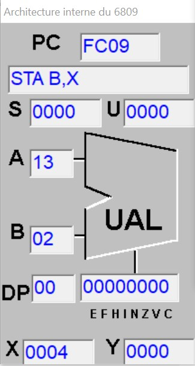

***
<pre>INSEA                  <i>Assembleur</i></pre>
***
<h1 style="text-align:center">Correction de TD2 et TD3</h1>

***
<pre>Samedi 04/01/2025       Auteur : Mrimi Imad</pre>

## TD2

### Exercice 1 :
Placez le complément à 1 du nombre de 16 bits placé dans les cellulles mémoire 0004 et 0005, dans les cases
mémoire 0006 et 0007.

**Solution Proposée** 
```
LDD $0004
COMA
COMB
STD $0006
END
``` 
- **Simulation pas à pas**


### Exercice 2 :
Refaire l'exercice 1 avec le complément à 2


**Solution Proposée** 
```
LDD $0004
COMA
COMB
INCB
STB $0007
BCC skip
BRA fin
skip:
INCA
fin:
STA $0006
END
``` 
- **Simulation pas à pas**


### Exercice 3 :
Que fait le programme suivant:
```
LDA $0003
CMPA $0004
BHS CAS
LDA $0004
STA $0005
CAS:
STA $0005
END
```

**Solution Proposée**   
Comparez entre les nombres placés dans les 
cases 0003 et 0004 et placez le plus grand dans la cellule 0005


### Exercice 4 :
Comparez entre les nombres placés dans les cases 0004 et 0005 et placez le plus petit dans la cellule 0006

**Solution Proposée** 
```
LDA $0005
CMPA $0004
BLS CAS
LDA $0004
STA $0006
CAS:
STA $0006
END
``` 
- **Simulation pas à pas**


## TD3

### Exercice 1 :
Soit une liste de nombres stockées dans la mémoire à partir de la case $0003. La longueur de cette liste
est stockée dans la case $0002. Calculez la somme de la liste et stockez la dans la case 0001. 

**Solution Proposée** 
```
LDX #$0003
LDA, X+
LDB #$01
FROM:
CMPB $0002 ;Condition d'arret
BHS TO
INCB
ADDA, X+
BRA FROM 
TO:
STA $0001
END
``` 
- **Simulation pas à pas**


### Exercice 2 :
On considère une liste dont la longueur est stockée dans la case mémoire 0003 et dont le premier
élément commence à l’adresse 0004. Ajoutez le contenu de l’adresse mémoire 0002 à cette liste

**Solution Proposée** 
```
LDX #$0004
LDB $0003
LDA $0002
STA B,X
END
``` 
- **Simulation pas à pas**





### Exercice 3 :
Refaîtes l’exercice n° 2 en vérifiant la condition suivante : un élément n’est ajouté que s’il ne figure pas
dans la liste

**Solution Proposée** 
```
LDX #$0004
LDB #$01
LDA ,X+
FROM:
CMPB $0003 ;Condition d'arret
BHS TO
CMPA $0002
BEQ SKIP; Vérification (registre Z) si égale sauter
INCB
LDA, X+
BRA FROM 
TO:
LDB $0002
STB ,X
END
SKIP:
END
``` 
- **Simulation pas à pas**


<!-- EX4 -->

### Exercice 4 :
On considère une liste dont la longueur est stockée dans la case mémoire 0003 et dont le premier
élément commence à l’adresse 0004. Ajoutez le contenu de l’adresse mémoire 0002 à cette liste

**Solution Proposée** 
```
LDX #$0002 ;Adresse de début
LDY #$0009 ;Adresse de transfert
LDA, X+
LDB #$01
FROM:
STA ,Y+
CMPB #$05 ;Condition d'arret pour table [5]
BHS TO
INCB
LDA, X+
BRA FROM 
TO:
END
``` 
- **Simulation pas à pas**


